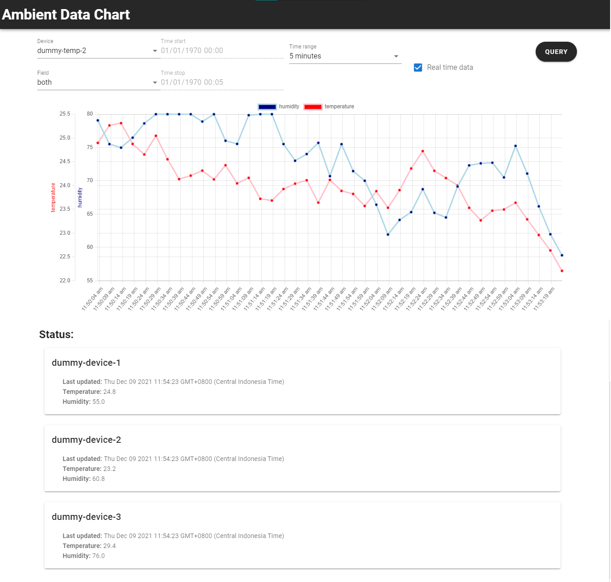

# dashboard-ambient-vue

Dashboard application for displaying ambient data from device simulator.
Created using vue2 template provided in https://github.com/tanand-tech/vue2template.

Screenshot of dashboard


## Project setup

```
npm install
```

### Compiles and hot-reloads for development

```
npm run serve
```

### Compiles and minifies for production

```
npm run build
```

### Lints and fixes files

```
npm run lint
```

### Customize configuration

See [Configuration Reference](https://cli.vuejs.org/config/).
